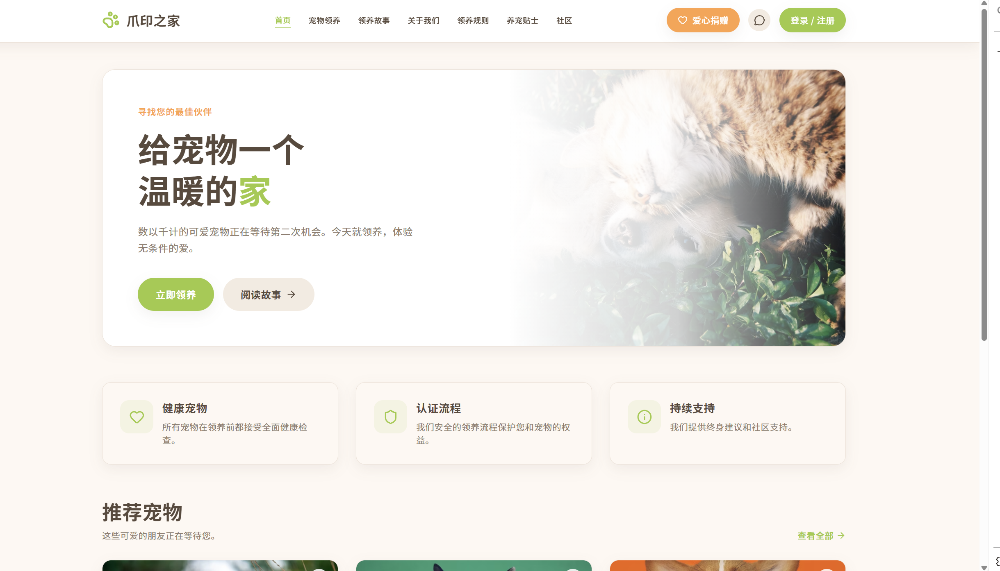
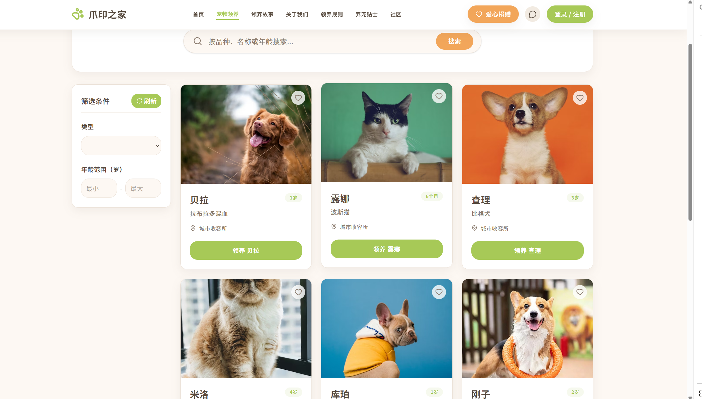
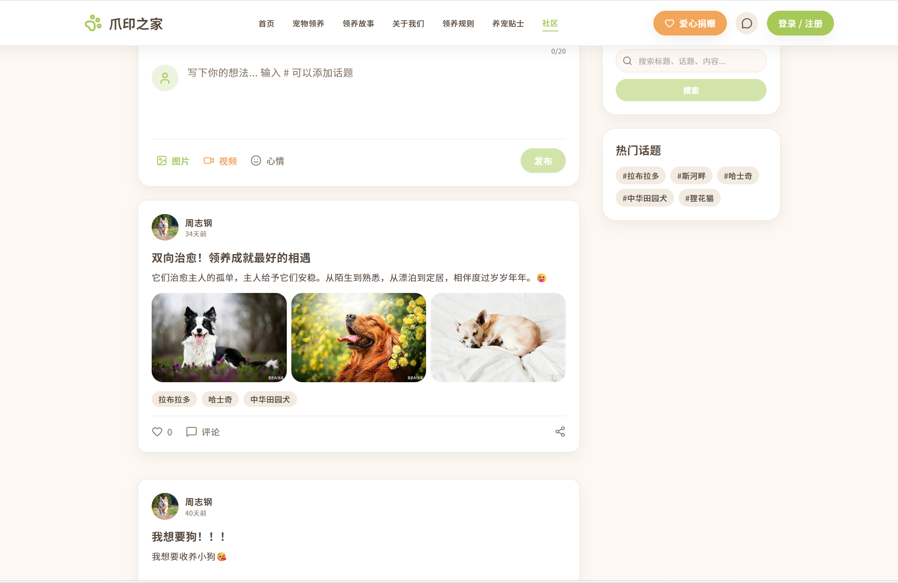
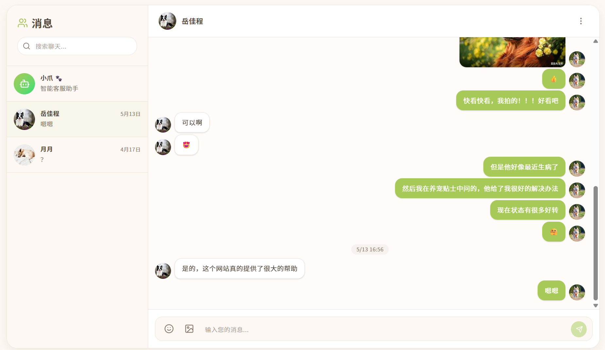

# 🐾 宠物领养平台 (Pet Adoption Platform)

<p align="center">
  <strong>一个基于 Spring Cloud 微服务架构的宠物领养社交平台</strong>
</p>

<p align="center">
  
  
  
</p>

---

## ✨ 项目简介

本项目是一个功能完善的**宠物领养与社交平台**，采用**Spring Cloud微服务架构**开发。旨在帮助流浪动物找到温暖的家，同时为宠物爱好者提供一个交流分享的社区。

### 🎯 核心功能

- **🐕 宠物管理** - 宠物信息展示、搜索、收藏
- **🤝 领养系统** - 在线申请、审核流程、领养记录
- **💬 社交互动** - 帖子发布、评论互动、话题讨论
- **💭 实时聊天** - WebSocket即时通讯、AI智能问答
- **❤️ 爱心捐赠** - 公益捐赠、捐赠记录
- **📖 宠物故事** - 温馨故事分享、故事评论
- **💼 招聘求职** - 宠物行业职位发布、求职申请
- **📚 养宠贴士** - 专业知识分享、AI智能问答（基于向量检索）

---

## 📸 界面预览

### 🏠 首页展示

<p align="center">
  
</p>

**首页特色：**
- 🎨 清新简约的 UI 设计，温馨的视觉体验
- 🐾 精选推荐宠物卡片展示
- 🔍 快速搜索与筛选功能
- 💚 一键领养申请入口
- 📖 宠物故事板块入口

---

### 🐕 宠物领养页面

<p align="center">
  
</p>

**领养功能亮点：**
- 🔍 多维度筛选（品种、年龄、性别等）
- ❤️ 收藏功能，方便关注心仪宠物
- 📋 详细的宠物信息展示
- ✅ 在线提交领养申请
- 📍 显示宠物所在位置信息

---

### 👥 社区互动页面

<p align="center">
  
</p>

**社区功能特色：**
- 📝 发布动态，分享养宠心得
- 🏷️ 热门话题标签系统
- 💬 评论互动，点赞收藏
- 📷 图片/视频上传支持
- 🔥 热门内容推荐算法

---

### 💬 即时聊天界面

<p align="center">
  
</p>

**聊天功能特性：**
- ⚡ WebSocket 实时通讯技术
- 🤖 **AI 智能助手** - 基于阿里云通义千问大模型
- 📱 支持文字、图片、表情消息
- 👥 私聊/群聊模式
- 🔔 消息实时推送通知

> **💡 AI 助手能力**：可以回答宠物养护、疾病预防、营养搭配等专业问题

---

## 🏗️ 系统架构

```
┌─────────────────────────────────────────────────────────────┐
│                      API Gateway (9000)                     │
│                   统一入口 / 路由转发 / 认证                  │
└─────────────────────────────────────────────────────────────┘
                              │
        ┌─────────────────────┼─────────────────────┐
        │                     │                     │
   ┌────▼────┐          ┌────▼────┐          ┌────▼────┐
   │ 用户服务 │          │ 管理员   │          │ 宠物服务 │
   │ (9001)  │          │ (9002)  │          │ (9008)  │
   └─────────┘          └─────────┘          └─────────┘
        │                     │                     │
   ┌────▼────┐          ┌────▼────┐          ┌────▼────┐
   │ 社交服务 │          │ 聊天服务 │          │ 捐赠服务 │
   │ (9003)  │          │ (9004)  │          │ (9005)  │
   └─────────┘          └─────────┘          └─────────┘
        │                     │                     │
   ┌────▼────┐          ┌────▼────┐          ┌────▼────┐
   │ 招聘服务 │          │ 故事服务 │          │ 贴士服务 │
   │ (9006)  │          │ (9007)  │          │ (9009)  │
   └─────────┘          └─────────┘          └─────────┘
                              │
              ┌───────────────┼───────────────┐
              │               │               │
         ┌────▼───┐    ┌─────▼────┐    ┌────▼────┐
         │ MySQL  │    │  Redis   │    │RabbitMQ │
         │ 数据库  │    │  缓存    │    │消息队列  │
         └────────┘    └──────────┘    └─────────┘
                              │
                    ┌─────────▼─────────┐
                    │      Nacos        │
                    │ 注册中心 / 配置中心│
                    └───────────────────┘
```

### 📦 微服务列表

| 服务名称 | 端口 | 功能描述 | 技术栈 |
|---------|------|---------|--------|
| **pet-gateway** | 9000 | API网关、路由、认证 | Spring Cloud Gateway |
| **pet-user** | 9001 | 用户注册登录、个人信息 | Spring Boot + MyBatis-Plus |
| **pet-admin** | 9002 | 后台管理系统 | Spring Boot + MyBatis-Plus |
| **pet-social** | 9003 | 社交帖子、评论、话题 | Spring Boot + OSS |
| **pet-chat** | 9004 | 实时聊天、AI问答 | WebSocket + Spring AI |
| **pet-donation** | 9005 | 爱心捐赠 | Spring Boot |
| **pet-recruitment** | 9006 | 招聘求职 | Spring Boot |
| **pet-story** | 9007 | 宠物故事 | Spring Boot |
| **pet-pet** | 9008 | 宠物信息管理 | Spring Boot |
| **pet-tips** | 9009 | 养宠知识、AI智能问答 | Spring AI + 向量数据库 |

---

## 🛠️ 技术栈

### 后端技术
- **框架**: Spring Boot 3.x, Spring Cloud 2023.x
- **注册中心**: Nacos (服务发现 & 配置管理)
- **API网关**: Spring Cloud Gateway
- **ORM框架**: MyBatis-Plus
- **数据库**: MySQL 8.0+
- **缓存**: Redis
- **消息队列**: RabbitMQ
- **文件存储**: 阿里云 OSS
- **AI能力**: 
  - 阿里云 DashScope (通义千问大模型)
  - 向量数据库 (文本嵌入 & 相似度检索)
- **API文档**: Knife4j (Swagger增强版)

### 开发工具
- **构建工具**: Maven
- **IDE**: IntelliJ IDEA (推荐)
- **JDK版本**: Java 17+
- **连接池**: Druid

---

## 📋 前置要求

在开始之前，请确保你的开发环境已安装以下软件：

### 必需组件
- [JDK 17+](https://adoptium.net/) (推荐 JDK 21)
- [Maven 3.8+](https://maven.apache.org/)
- [MySQL 8.0+](https://dev.mysql.com/downloads/)
- [Redis 6.0+](https://redis.io/download)
- [RabbitMQ 3.12+](https://www.rabbitmq.com/download.html)
- [Nacos 2.3+](https://nacos.io/zh-cn/docs/v2/quickstart/quick-start.html) (单机模式即可)

### 可选组件（用于AI功能）
- 阿里云 DashScope API Key ([获取地址](https://dashscope.console.aliyun.com/))
- 阿里云 OSS AccessKey ([获取地址](https://ram.console.aliyun.com/manage/ak))

---

## 🚀 快速开始

### 第一步：克隆项目

```bash
git clone https://github.com/yue-netizen/pet-springboot.git
cd pet-springboot
```

### 第二步：配置环境变量

⚠️ **重要：必须配置环境变量才能正常运行！**

#### 方式一：使用 .env 文件（推荐）

```bash
# 复制环境变量模板
cp .env.example .env

# 编辑 .env 文件，填入你的真实配置
# Windows: notepad .env
# Mac/Linux: vim .env
```

编辑 `.env` 文件，修改以下关键配置：

```bash
# 数据库密码（必须修改！）
DB_PASSWORD=your_secure_password_here

# Redis密码（建议修改）
REDIS_PASSWORD=your_redis_password

# RabbitMQ密码（建议修改）
RABBITMQ_PASSWORD=your_rabbitmq_password

# JWT密钥（非常重要！必须修改为强密码）
JWT_SECRET_KEY=your_very_long_and_secure_jwt_secret_key_here

# 阿里云配置（如果需要文件上传和AI功能）
OSS_ACCESS_KEY_ID=your_oss_access_key_id
OSS_ACCESS_KEY_SECRET=your_oss_access_key_secret
DASHSCOPE_API_KEY=your_dashscope_api_key
```

#### 方式二：直接设置环境变量

```bash
# Linux/Mac
export DB_PASSWORD=your_password
export REDIS_PASSWORD=your_redis_password
export JWT_SECRET_KEY=your_jwt_secret_key

# Windows PowerShell
$env:DB_PASSWORD="your_password"
$env:REDIS_PASSWORD="your_redis_password"
$env:JWT_SECRET_KEY="your_jwt_secret_key"
```

### 第三步：初始化数据库

```bash
# 登录 MySQL
mysql -u root -p

# 执行初始化脚本（会自动创建数据库和表结构）
source sql/init.sql
```

或使用 MySQL 客户端工具导入 `sql/init.sql` 文件。

### 第四步：启动基础服务

**启动顺序很重要！请按以下顺序启动：**

1. **启动 Nacos**
   ```bash
   # 进入 Nacos 目录
   cd nacos/bin
   
   # 单机模式启动
   # Linux/Mac
   sh startup.sh -m standalone
   
   # Windows
   startup.cmd -m standalone
   ```
   
   访问 http://localhost:8848/nacos （默认账号密码：nacos/nacos）

2. **启动 Redis**
   ```bash
   redis-server
   ```

3. **启动 RabbitMQ**
   ```bash
   # Windows: 直接运行 RabbitMQ 服务
   # Linux/Mac:
   sudo systemctl start rabbitmq-server
   ```
   
   访问 http://localhost:15672 （默认账号密码：guest/guest）

### 第五步：启动微服务

**方式一：使用 IDE 启动（推荐用于开发）**

在 IntelliJ IDEA 中依次启动：
1. `GatewayApplication` (网关服务)
2. `UserApplication` (用户服务)
3. `AdminApplication` (管理员服务)
4. 其他服务按需启动...

**方式二：命令行打包运行**

```bash
# 打包所有模块（跳过测试）
mvn clean package -DskipTests

# 启动各个服务（需要按顺序）
java -jar pet-gateway/target/gateway.jar
java -jar pet-user/target/user.jar
java -jar pet-admin/target/admin.jar
# ... 其他服务
```

### 第六步：验证安装

访问以下地址确认服务已正常启动：

- **API文档（Knife4j）**: http://localhost:9000/doc.html
- **用户服务健康检查**: http://localhost:9001/actuator/health
- **Nacos控制台**: http://localhost:8848/nacos (查看已注册的服务列表)

---

## 📖 使用指南

### API接口文档

项目集成了 **Knife4j** (Swagger的增强版)，启动后可在线查看和测试API：

- **统一入口**: http://localhost:9000/doc.html
- 各服务的API文档会自动聚合到网关

### 主要接口示例

#### 用户认证
```bash
# 用户注册
POST http://localhost:9000/api/auth/register
Content-Type: application/json

{
  "username": "testuser",
  "password": "123456",
  "nickname": "测试用户"
}

# 用户登录
POST http://localhost:9000/api/auth/login
Content-Type: application/json

{
  "username": "testuser",
  "password": "123456"
}
```

#### 获取宠物列表
```bash
GET http://localhost:9000/api/pet/list?pageNum=1&pageSize=10
```

#### 发布帖子（需要Token）
```bash
POST http://localhost:9000/api/social/post
Authorization: Bearer {your_token}
Content-Type: application/json

{
  "title": "我的宠物故事",
  "content": "今天领养了一只可爱的小狗...",
  "tags": ["狗狗","领养"]
}
```

> 💡 更多接口请查看在线API文档

---

## 🔧 配置说明

### 核心配置项

所有敏感配置都支持通过**环境变量**覆盖，优先级如下：

```
环境变量 > application.yaml中的默认值
```

#### 必须配置的安全相关参数

| 参数名 | 环境变量 | 说明 | 默认值 |
|--------|---------|------|--------|
| 数据库密码 | DB_PASSWORD | MySQL密码 | 123456 ⚠️ |
| Redis密码 | REDIS_PASSWORD | Redis密码 | 123321 ⚠️ |
| RabbitMQ密码 | RABBITMQ_PASSWORD | MQ密码 | guest ⚠️ |
| JWT密钥 | JWT_SECRET_KEY | Token签名密钥 | ⚠️ 必须修改 |

#### 可选的功能性参数

| 参数名 | 环境变量 | 说明 | 默认值 |
|--------|---------|------|--------|
| Nacos地址 | NACOS_SERVER_ADDR | 注册中心地址 | localhost:8848 |
| OSS AccessKey | OSS_ACCESS_KEY_ID | 阿里云密钥ID | 空（需配置）|
| OSS Secret | OSS_ACCESS_KEY_SECRET | 阿里云密钥Secret | 空（需配置）|
| DashScope Key | DASHSCOPE_API_KEY | AI服务API Key | 空（需配置）|

### 自定义端口

如需修改服务端口，可在各服务的 `application.yaml` 中修改 `server.port`，或设置环境变量：

```bash
export GATEWAY_PORT=8080
export USER_SERVICE_PORT=8081
```

---

## 🏗️ 项目结构

```
pet-github/
├── pet-springboot/              # 后端微服务主目录
│   ├── pet-common/             # 公共模块（工具类、实体基类、Feign客户端）
│   ├── pet-gateway/            # API网关服务
│   ├── pet-user/               # 用户服务
│   ├── pet-admin/              # 管理员服务
│   ├── pet-social/             # 社交服务
│   ├── pet-chat/               # 聊天服务（含AI功能）
│   ├── pet-pet/                # 宠物服务
│   ├── pet-donation/           # 捐赠服务
│   ├── pet-recruitment/        # 招聘服务
│   ├── pet-story/              # 故事服务
│   ├── pet-tips/               # 养宠贴士服务（含向量检索AI）
│   ├── sql/                    # 数据库初始化脚本
│   ├── data/                   # 数据文件（向量存储等）
│   └── pom.xml                 # 父POM（依赖管理）
├── pet-vue/                    # 前端 Vue 项目
│   ├── src/
│   ├── public/
│   └── package.json
├── .gitignore                  # Git忽略规则
└── README.md                   # 本文件 - 项目说明文档
```

---

## ⚠️ 已知问题与待改进功能

### 🤖 AI 智能助手（RAG 系统）相关问题

> **当前状态**：AI 功能已集成，但存在以下已知问题需要优化

#### ⚡ 响应速度问题

**问题描述：**
- AI 助手在回答问题时，响应时间较长（通常需要 5-15 秒）
- 用户提问后可能需要等待较长时间才能收到回复

**原因分析：**
1. **RAG 向量检索流程复杂**
   - 用户问题 → 文本向量化 → 向量数据库相似度检索 → 获取相关文档片段 → 组装 Prompt → 调用大模型 API → 生成回复
   
2. **向量切片粒度问题**
   - 当前文档切片策略可能不够优化，导致检索到过多或过少的相关内容
   - 切片过大：包含冗余信息，增加 Token 消耗和处理时间
   - 切片过小：丢失上下文信息，影响回答质量

3. **外部 API 调用延迟**
   - 阿里云 DashScope API 的网络延迟
   - 通义千问大模型的推理时间

**优化方向（TODO）：**
- [ ] 优化文档切片策略（如：按语义段落切片、动态调整切片大小）
- [ ] 引入缓存机制（相似问题的缓存复用）
- [ ] 优化 Prompt 模板，减少 Token 数量
- [ ] 考虑使用流式输出（Streaming）提升用户体验
- [ ] 添加请求队列和并发控制
- [ ] 引入本地向量数据库（如 Milvus）替代远程服务

---

### 💬 即时聊天功能待完善项

> **当前状态**：基础聊天功能可用，以下功能正在开发中

#### 🔧 需要改进的功能

| 功能模块 | 当前状态 | 优先级 | 计划完成时间 |
|---------|---------|--------|-------------|
| **消息历史记录持久化** | 仅内存存储 | 🔴 高 | 待开发 |
| **离线消息推送** | 未实现 | 🔴 高 | 待开发 |
| **文件/图片发送** | 基础支持 | 🟡 中 | 优化中 |
| **消息已读回执** | 未实现 | 🟡 中 | 待开发 |
| **输入状态提示（正在输入...）** | 未实现 | 🟢 低 | 待开发 |
| **消息撤回功能** | 未实现 | 🟢 低 | 待开发 |
| **群聊管理功能** | 基础实现 | 🟡 中 | 完善中 |
| **聊天记录搜索** | 未实现 | 🟢 低 | 待开发 |

#### 📋 技术细节说明

**WebSocket 连接管理：**
```java
// 当前实现基于 Spring WebSocket
// 支持单机部署，集群场景需引入 Redis Pub/Sub 或 RabbitMQ
```

**AI 对话上下文限制：**
- 当前每次对话独立，未维护长期会话上下文
- 建议：引入 Redis 存储对话历史，支持多轮对话记忆

**性能优化建议：**
- [ ] 使用 Netty 替代 Tomcat WebSocket（更高并发）
- [ ] 消息压缩传输（减少带宽占用）
- [ ] 心跳检测机制优化（更准确的在线状态）
- [ ] 消息队列削峰填谷（高并发场景）

---

### 📌 其他待优化项

- [ ] **前端性能优化**：图片懒加载、路由懒加载、组件按需加载
- [ ] **移动端适配**：部分页面在移动设备上显示效果需优化
- [ ] **国际化支持**：目前仅支持中文界面
- [ ] **单元测试覆盖率**：核心业务逻辑测试覆盖待提升
- [ ] **API 接口限流**：网关层需添加更细粒度的限流策略
- [ ] **日志系统完善**：结构化日志、链路追踪（ELK/SkyWalking）

---

> 💡 **欢迎贡献代码！** 如果你对以上任何问题有解决方案或优化建议，欢迎提交 Issue 或 Pull Request！

---

## 🔒 安全注意事项

### ⚠️ 开源前必读

本项目已经过安全审查并做了以下处理：

✅ **已完成的安全措施：**

1. **敏感信息外部化** - 所有密码、密钥支持环境变量配置
2. **添加完整 .gitignore** - 防止提交敏感文件
3. **提供 .env.example 模板** - 引导用户正确配置
4. **代码注释完善** - 包含详细的安全提示
5. **移除硬编码密钥** - JWT等密钥支持外部配置

🔧 **你需要做的：**

1. **复制并配置 .env 文件**
   ```bash
   cp .env.example .env
   # 编辑 .env，填入真实配置
   ```

2. **修改默认密码** - 特别是：
   - `DB_PASSWORD` - 数据库密码
   - `JWT_SECRET_KEY` - JWT密钥（最重要！）

3. **不要提交 .env 文件** - 已在 .gitignore 中排除

### 生产环境部署建议

- [ ] 使用强密码（至少32位随机字符串）
- [ ] 启用 HTTPS
- [ ] 配置防火墙规则
- [ ] 定期备份数据库
- [ ] 监控日志异常
- [ ] 使用配置中心（如Nacos Config）管理生产配置
- [ ] 考虑使用 Kubernetes 或 Docker Compose 进行容器化部署

---

## 🤝 贡献指南

欢迎贡献代码！请遵循以下流程：

1. **Fork 本仓库**
2. **创建特性分支** (`git checkout -b feature/amazing-feature`)
3. **提交更改** (`git commit -m 'Add some amazing feature'`)
4. **推送到分支** (`git push origin feature/amazing-feature`)
5. **提交 Pull Request**

### 代码规范

- 遵循阿里巴巴 Java 开发手册
- 使用 Lombok 减少样板代码
- 保持良好的注释习惯
- 提交信息格式：`type(scope): subject` (例：feat(user): add avatar upload)

---

## 📄 开源协议

本项目采用 [MIT License](LICENSE) 开源协议。

```
MIT License

Copyright (c) 2024 Pet Adoption Platform

Permission is hereby granted, free of charge, to any person obtaining a copy
of this software and associated documentation files (the "Software"), to deal
in the Software without restriction, including without limitation the rights
to use, copy, modify, merge, publish, distribute, sublicense, and/or sell
copies of the Software...
```

---

## 🙏 致谢

感谢以下开源项目和服务：

- [Spring](https://spring.io/) - 企业级Java开发框架
- [MyBatis-Plus](https://baomidou.com/) - 强大的MyBatis增强工具
- [Nacos](https://nacos.io/) - 动态服务发现和配置管理平台
- [Knife4j](https://doc.xiaominfo.com/) - Swagger增强解决方案
- [阿里云 DashScope](https://dashscope.console.aliyun.com/) - AI大模型服务

---

## 📞 联系我们

- **Issues**: [GitHub Issues](https://github.com/yue-netizen/pet-springboot/issues)

---

## 📊 项目统计

- **总代码行数**: ~15,000+
- **微服务数量**: 10个
- **API接口数**: 100+
- **数据库表**: 15+

<div align="center">

**如果这个项目对你有帮助，请给一个 ⭐ Star 支持一下！**

Made with ❤️ for pets everywhere 🐾

</div>
